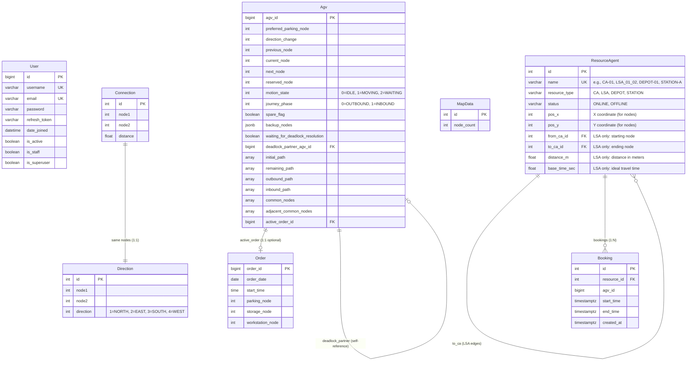

# AGV Fleet Management System - Database Schema

**Version:** 2.0  
**Last Updated:** November 28, 2025  
**Database:** PostgreSQL 13+

---

## Table of Contents

1. [Overview](#overview)
2. [Entity Relationship Diagram](#entity-relationship-diagram)
3. [Table Specifications](#table-specifications)
4. [Indexes & Constraints](#indexes--constraints)
5. [Data Dictionary](#data-dictionary)

---

## Overview

The database schema supports the SSI-DMAS-ET (Sequential Single-Item Auction with Delegate Multi-Agent System and Energy-Time) warehouse management system. The schema is organized into the following modules:

- **AGV Management** (`agv_data`): AGV entities, resource agents, and bookings
- **Order Management** (`order_data`): Customer orders and task allocation
- **Map Management** (`map_data`): Warehouse map topology and connections
- **User Management** (`users`): Authentication and authorization
- **Reservation System** (`reservation`): Time-based resource booking (uses ResourceAgent and Booking from agv_data)

---

## Entity Relationship Diagram



---

## Table Specifications

### 1. User Management

#### users_user

Authentication and authorization for web application users.

| Column | Type | Constraints | Description |
|--------|------|-------------|-------------|
| id | BIGSERIAL | PK | Auto-incrementing user ID |
| username | VARCHAR(150) | UNIQUE, NOT NULL | Unique username |
| email | VARCHAR(254) | UNIQUE, NOT NULL | Email address |
| password | VARCHAR(128) | NOT NULL | Hashed password |
| refresh_token | TEXT | NULL | JWT refresh token |
| first_name | VARCHAR(150) | NULL | First name |
| last_name | VARCHAR(150) | NULL | Last name |
| is_active | BOOLEAN | DEFAULT TRUE | Account active status |
| is_staff | BOOLEAN | DEFAULT FALSE | Staff access |
| is_superuser | BOOLEAN | DEFAULT FALSE | Superuser access |
| date_joined | TIMESTAMPTZ | DEFAULT NOW() | Registration date |

**Indexes:**
- Primary key index on `id`
- Unique index on `username`
- Unique index on `email`

---

### 2. Order Management

#### order_data_order

Customer orders with pickup/delivery locations.

| Column | Type | Constraints | Description |
|--------|------|-------------|-------------|
| order_id | BIGSERIAL | PK | Order identifier |
| order_date | DATE | NOT NULL | Order placement date |
| start_time | TIME | NOT NULL | Scheduled start time |
| parking_node | INTEGER | NOT NULL | AGV parking location |
| storage_node | INTEGER | NOT NULL | Item pickup location |
| workstation_node | INTEGER | NOT NULL | Delivery destination |

**Business Rules:**
- Route: `parking_node` → `storage_node` (pickup) → `workstation_node` (deliver)
- Used by Auction System for baseline calculation
- Referenced by AGV when assigned

**Indexes:**
- Primary key index on `order_id`
- Index on `order_date` for historical queries

---

### 3. AGV Management

#### agv_data_agv

AGV state according to DSPA (Dynamic Space-time resource allocation with PSO Algorithm).

| Column | Type | Constraints | Description |
|--------|------|-------------|-------------|
| agv_id | BIGINT | PK | AGV identifier |
| preferred_parking_node | INTEGER | NOT NULL | Home parking location |
| direction_change | INTEGER | NULL | 0=STRAIGHT, 1=REVERSE, 2=LEFT, 3=RIGHT |
| previous_node | INTEGER | NULL | Last visited node |
| current_node | INTEGER | NULL | Current position (v_c^i) |
| next_node | INTEGER | NULL | Next target (v_n^i) |
| reserved_node | INTEGER | NULL | Reserved node (v_r^i) |
| motion_state | INTEGER | DEFAULT 0 | 0=IDLE, 1=MOVING, 2=WAITING |
| journey_phase | INTEGER | DEFAULT 0 | 0=OUTBOUND, 1=INBOUND |
| spare_flag | BOOLEAN | DEFAULT FALSE | F^i: sufficient spare points flag |
| backup_nodes | JSONB | NULL | Backup navigation nodes |
| waiting_for_deadlock_resolution | BOOLEAN | DEFAULT FALSE | Deadlock state |
| deadlock_partner_agv_id | BIGINT | FK (self), NULL | Deadlock partner reference |
| initial_path | INTEGER[] | NULL | Original planned path |
| remaining_path | INTEGER[] | NULL | Unfinished path segments |
| outbound_path | INTEGER[] | NULL | Parking → storage → workstation |
| inbound_path | INTEGER[] | NULL | Workstation → parking |
| common_nodes | INTEGER[] | NULL | Shared nodes with other AGVs |
| adjacent_common_nodes | INTEGER[] | NULL | Adjacent shared nodes |
| active_order_id | BIGINT | FK, NULL | Currently assigned order |

**Foreign Keys:**
- `active_order_id` → `order_data_order(order_id)` ON DELETE SET NULL
- `deadlock_partner_agv_id` → `agv_data_agv(agv_id)` ON DELETE SET NULL

**Indexes:**
- Primary key index on `agv_id`
- Index on `active_order_id` for order-to-AGV lookups
- Index on `motion_state` for state-based queries

---

#### agv_data_resourceagent

Resources in the D-MAS system (nodes and edges in warehouse graph).

| Column | Type | Constraints | Description |
|--------|------|-------------|-------------|
| id | SERIAL | PK | Resource identifier |
| name | VARCHAR(100) | UNIQUE, NOT NULL | Resource name (e.g., CA-01, LSA_01_02) |
| resource_type | VARCHAR(10) | NOT NULL | CA, LSA, DEPOT, STATION |
| status | VARCHAR(10) | DEFAULT 'ONLINE' | ONLINE, OFFLINE |
| pos_x | INTEGER | DEFAULT 0 | X coordinate (nodes only) |
| pos_y | INTEGER | DEFAULT 0 | Y coordinate (nodes only) |
| from_ca_id | INTEGER | FK (self), NULL | LSA only: starting node |
| to_ca_id | INTEGER | FK (self), NULL | LSA only: ending node |
| distance_m | FLOAT | DEFAULT 0.0 | LSA only: edge distance (meters) |
| base_time_sec | FLOAT | DEFAULT 0.0 | LSA only: ideal travel time (seconds) |

**Resource Types:**
- **CA (Crossroad Agent)**: Junction/intersection nodes
- **LSA (Logical Segment Agent)**: Road segments between nodes (edges)
- **DEPOT**: AGV parking/charging stations
- **STATION**: Pickup/delivery workstations

**Foreign Keys:**
- `from_ca_id` → `agv_data_resourceagent(id)` ON DELETE SET NULL
- `to_ca_id` → `agv_data_resourceagent(id)` ON DELETE SET NULL

**Constraints:**
- `CHECK (resource_type IN ('CA', 'LSA', 'DEPOT', 'STATION'))`
- `CHECK (status IN ('ONLINE', 'OFFLINE'))`
- For LSA: `from_ca_id` and `to_ca_id` must reference non-LSA resources

**Indexes:**
- Primary key index on `id`
- Unique index on `name`
- Index on `resource_type` for type-specific queries
- Index on `from_ca_id` for graph traversal
- Index on `to_ca_id` for graph traversal

---

#### agv_data_booking

Time-based resource reservations (Reservation Table).

| Column | Type | Constraints | Description |
|--------|------|-------------|-------------|
| id | SERIAL | PK | Booking identifier |
| resource_id | INTEGER | FK, NOT NULL | Reserved resource |
| agv_id | BIGINT | NOT NULL | AGV making reservation |
| start_time | TIMESTAMPTZ | NOT NULL | Occupation start time |
| end_time | TIMESTAMPTZ | NOT NULL | Release time |
| created_at | TIMESTAMPTZ | DEFAULT NOW() | Booking creation timestamp |

**Foreign Keys:**
- `resource_id` → `agv_data_resourceagent(id)` ON DELETE CASCADE

**Constraints:**
- `CHECK (end_time > start_time)` - Valid time range
- No overlapping bookings for same resource (enforced by application layer + locking)

**Indexes:**
- Primary key index on `id`
- Composite index on `(resource_id, start_time)` - Conflict detection
- Composite index on `(resource_id, end_time)` - Conflict detection
- Index on `agv_id` - AGV booking lookups

**Critical for:**
- Exploring Ant: Query availability without booking
- Intention Ant: Strict booking with conflict detection
- Concurrency: Uses `SELECT FOR UPDATE` for pessimistic locking

---

### 4. Map Management

#### map_data_mapdata

General map metadata.

| Column | Type | Constraints | Description |
|--------|------|-------------|-------------|
| id | SERIAL | PK | Map configuration ID |
| node_count | INTEGER | DEFAULT 0 | Total nodes in warehouse |

**Note:** Typically single-row table for map configuration.

---

#### map_data_connection

Node-to-node connections with distances.

| Column | Type | Constraints | Description |
|--------|------|-------------|-------------|
| id | SERIAL | PK | Connection identifier |
| node1 | INTEGER | NOT NULL | Starting node |
| node2 | INTEGER | NOT NULL | Ending node |
| distance | FLOAT | NOT NULL | Distance between nodes |

**Constraints:**
- `UNIQUE (node1, node2)` - One connection per node pair
- `CHECK (distance >= 0)` - Non-negative distance

**Indexes:**
- Primary key index on `id`
- Unique composite index on `(node1, node2)`
- Index on `node1` for adjacency queries
- Index on `node2` for reverse adjacency

**Note:** Used alongside `ResourceAgent` for pathfinding. Some redundancy exists for backward compatibility.

---

#### map_data_direction

Cardinal directions between nodes.

| Column | Type | Constraints | Description |
|--------|------|-------------|-------------|
| id | SERIAL | PK | Direction identifier |
| node1 | INTEGER | NOT NULL | Reference node |
| node2 | INTEGER | NOT NULL | Target node |
| direction | INTEGER | NOT NULL | 1=NORTH, 2=EAST, 3=SOUTH, 4=WEST |

**Constraints:**
- `UNIQUE (node1, node2)` - One direction per node pair
- `CHECK (direction BETWEEN 1 AND 4)` - Valid cardinal direction

**Indexes:**
- Primary key index on `id`
- Unique composite index on `(node1, node2)`
- Index on `node1` for direction lookups

**Purpose:** Navigation and UI visualization (arrow directions).

---

## Indexes & Constraints Summary

### Primary Keys
All tables have auto-incrementing primary keys for efficient lookups and foreign key references.

### Foreign Keys
- Enforce referential integrity
- Cascade deletions where appropriate (e.g., bookings deleted when resource deleted)
- SET NULL for optional relationships (e.g., AGV's active order)

### Unique Constraints
- `users_user.username` - Prevent duplicate usernames
- `users_user.email` - Prevent duplicate emails
- `agv_data_resourceagent.name` - Unique resource identifiers
- `map_data_connection(node1, node2)` - One connection per node pair
- `map_data_direction(node1, node2)` - One direction per node pair

### Check Constraints
- `agv_data_booking.end_time > start_time` - Valid time ranges
- `agv_data_resourceagent.resource_type IN (...)` - Valid resource types
- `map_data_connection.distance >= 0` - Non-negative distances
- `map_data_direction.direction BETWEEN 1 AND 4` - Valid cardinal directions

### Performance Indexes

**Reservation System (Critical for Performance):**
```sql
CREATE INDEX idx_booking_resource_start ON agv_data_booking(resource_id, start_time);
CREATE INDEX idx_booking_resource_end ON agv_data_booking(resource_id, end_time);
CREATE INDEX idx_booking_agv ON agv_data_booking(agv_id);
```

**Map Service (Pathfinding):**
```sql
CREATE INDEX idx_resourceagent_type ON agv_data_resourceagent(resource_type);
CREATE INDEX idx_resourceagent_from_ca ON agv_data_resourceagent(from_ca_id);
CREATE INDEX idx_resourceagent_to_ca ON agv_data_resourceagent(to_ca_id);
CREATE INDEX idx_connection_node1 ON map_data_connection(node1);
CREATE INDEX idx_connection_node2 ON map_data_connection(node2);
```

**AGV & Order Queries:**
```sql
CREATE INDEX idx_agv_active_order ON agv_data_agv(active_order_id);
CREATE INDEX idx_agv_motion_state ON agv_data_agv(motion_state);
CREATE INDEX idx_order_date ON order_data_order(order_date);
```

---

## Data Dictionary

### Enumerations

#### Motion State (agv_data_agv.motion_state)
| Value | Name | Description |
|-------|------|-------------|
| 0 | IDLE | No mission assigned |
| 1 | MOVING | Traveling to next node |
| 2 | WAITING | Stopped at current node |

#### Journey Phase (agv_data_agv.journey_phase)
| Value | Name | Description |
|-------|------|-------------|
| 0 | OUTBOUND | Parking → Storage → Workstation |
| 1 | INBOUND | Workstation → Parking |

#### Direction Change (agv_data_agv.direction_change)
| Value | Name | Description |
|-------|------|-------------|
| 0 | GO_STRAIGHT | Continue straight |
| 1 | TURN_AROUND | Reverse/U-turn |
| 2 | TURN_LEFT | Turn left |
| 3 | TURN_RIGHT | Turn right |

#### Resource Type (agv_data_resourceagent.resource_type)
| Value | Description | Graph Role |
|-------|-------------|-----------|
| CA | Crossroad Agent | Node (junction) |
| LSA | Logical Segment Agent | Edge (road segment) |
| DEPOT | Depot Station | Node (parking/charging) |
| STATION | Pickup/Delivery Station | Node (workstation) |

#### Resource Status (agv_data_resourceagent.status)
| Value | Description |
|-------|-------------|
| ONLINE | Available for use |
| OFFLINE | Maintenance/unavailable |

#### Cardinal Direction (map_data_direction.direction)
| Value | Name | Description |
|-------|------|-------------|
| 1 | NORTH | Upward |
| 2 | EAST | Rightward |
| 3 | SOUTH | Downward |
| 4 | WEST | Leftward |

---

## Data Volume Estimates (Production)

| Table | Estimated Rows | Growth Rate | Notes |
|-------|----------------|-------------|-------|
| users_user | 10-50 | Static | Admin/operator accounts |
| order_data_order | 1,000-10,000 | Daily | Historical orders |
| agv_data_agv | 10-100 | Static | Number of AGVs in fleet |
| agv_data_resourceagent | 200-500 | Static | Map topology (nodes + edges) |
| agv_data_booking | 10,000-100,000 | Hourly | Active + historical reservations |
| map_data_connection | 500-2,000 | Static | Map connections |
| map_data_direction | 500-2,000 | Static | Map directions |

**Cleanup Recommendations:**
- Archive `order_data_order` older than 1 year
- Purge `agv_data_booking` older than 7 days (use management command)
- Keep `agv_data_resourceagent` and map tables indefinitely

---

## Database Maintenance

### Vacuum & Analyze
```sql
-- Weekly maintenance
VACUUM ANALYZE agv_data_booking;
VACUUM ANALYZE agv_data_agv;
VACUUM ANALYZE order_data_order;
```

### Cleanup Old Bookings
```bash
# Django management command
docker exec django_app python manage.py cleanup_bookings --days 7
```

### Backup Strategy
```bash
# Daily backup
docker exec postgres_db pg_dump -U postgres agv_db > backup_$(date +%Y%m%d).sql

# Restore
docker exec -i postgres_db psql -U postgres agv_db < backup_20251128.sql
```

---

## Migration History

| Version | Date | Changes |
|---------|------|---------|
| 2.0 | 2025-11-27 | Added Booking model, refactored ResourceAgent |
| 1.5 | 2025-11-09 | Added AGV journey phase fields |
| 1.0 | 2025-11-07 | Initial schema with Order, AGV, Map tables |

---

**Document Maintainer:** Nghia Nguyen  
**Last Reviewed:** November 28, 2025  
**Next Review:** January 2026